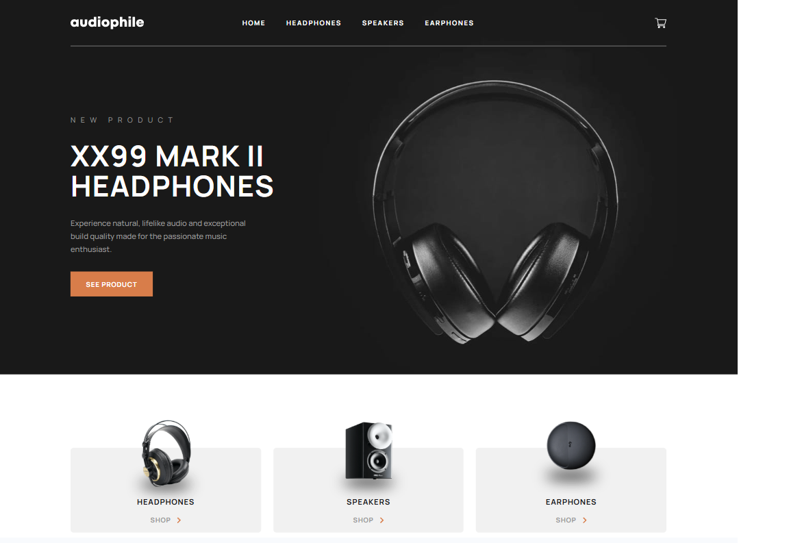

## Overview

### Installation

### Clone the repository

git clone https://github.com/thentrsfs/audiophilewebsite

### Install dependencies

cd audiophile-ecommerce-website
npm install

### Start development server

npm run dev

### The challenge

Users should be able to:

- View the optimal layout for the app depending on their device's screen size
- See hover states for all interactive elements on the page
- Add/Remove products from the cart
- Edit product quantities in the cart
- Fill in all fields in the checkout
- Receive form validations if fields are missed or incorrect during checkout
- See correct checkout totals depending on the products in the cart
  - Shipping always adds $50 to the order
  - VAT is calculated as 20% of the product total, excluding shipping
- See an order confirmation modal after checking out with an order summary
- **Bonus**: Keep track of what's in the cart, even after refreshing the browser (`localStorage` could be used for this if you're not building out a full-stack app)

### Screenshot

### Links

- Solution URL: [Add solution URL here](https://your-solution-url.com)
- Live Site URL: [Add live site URL here](https://your-live-site-url.com)

## My process

### Built with

- React
- Tailwind CSS
- JavaScript (ES6+)
- LocalStorage (for cart persistence)

## Author

- Frontend Mentor - [@thentrsfs](https://www.frontendmentor.io/profile/thentrsfs)
